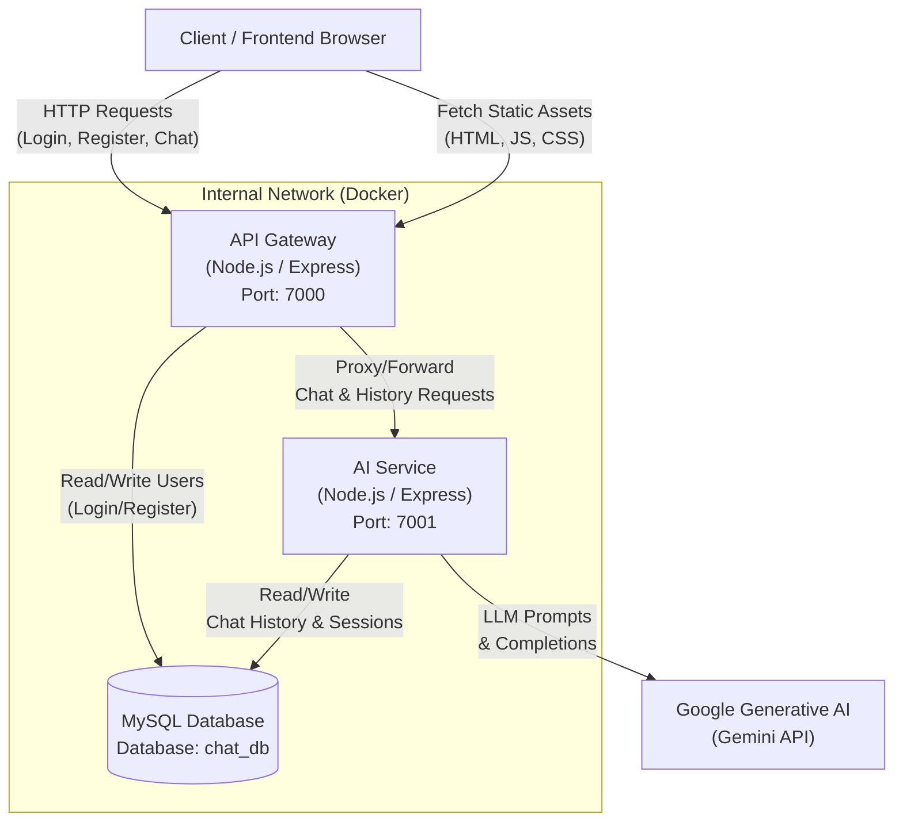

# Arsitektur Sistem Distributed AI Chat

Berikut adalah diagram arsitektur untuk sistem **Distributed AI Chat**. Sistem ini menggunakan pendekatan arsitektur berbasis *microservices* sederhana di mana tugas-tugas dipisahkan antara *API Gateway*, *AI Service*, dan *Database*.

## Deskripsi Komponen

1. **Client (Frontend)**
   - Antarmuka pengguna yang berjalan di browser. Terdiri dari HTML, CSS, dan JavaScript statis.
   - Mengakses aplikasi melalui URL Gateway atau *web server* Nginx.
   - Mengirim permintaan HTTP (REST) ke API Gateway.

2. **API Gateway**
   - Bertindak sebagai pintu masuk tunggal (entry point) untuk semua *request* dari *client*.
   - **Tanggung Jawab:**
     - Melayani *file static* frontend.
     - Menyediakan dokumentasi Swagger API.
     - Menangani otentikasi sederhana (Login, Register) dan middleware validasi `X-API-KEY`.
     - Melakukan *routing* (forwarding) *request* yang berkaitan dengan AI (`/api/chat`, `/api/history`) ke **AI Service**.
   - Terhubung secara langsung ke **Database MySQL** untuk membaca dan menulis data *user*.

3. **AI Service**
   - Layanan khusus yang menangani logika utama AI (Large Language Model).
   - **Tanggung Jawab:**
     - Menerima dan memproses pesan (prompt) dari pengguna.
     - Mengelola konteks riwayat percakapan (session history) dari database agar AI memiliki memori percakapan.
     - Berkomunikasi langsung dengan API pihak ketiga (**Google Generative AI / Gemini**).
   - Terhubung ke **Database MySQL** untuk menyimpan dan mengambil riwayat *chat* per sesi.

4. **Database (MySQL)**
   - Menyimpan seluruh data sistem agar persisten.
   - **Tabel Utama:**
     - `users`: Menyimpan kredensial pengguna (id, username, password).
     - `chat_history`: Menyimpan rekam jejak obrolan, relasi user, dan ID Sesi (session_id).

5. **Google Generative AI (Gemini API)**
   - Layanan eksternal (Pihak Ketiga) yang memberikan kemampuan AI generatif (menjawab pesan chat berdasarkan instruksi sistem).
